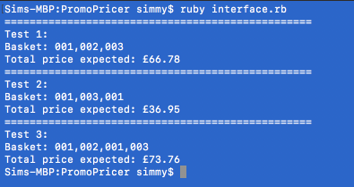

# PromoPricer
Ruby BackEnd code for applying Promotions at Checkout.
## To Run
First clone the repository, and 'cd' into it.
Install necessary dependencies by running:
```
bundle install
```
To run the tests, from the main directory, run:
```
rspec -fd
```
To run an example of the Back End using the Test Data, from the main directory, run:
```
ruby interface.rb
```
## Approach
- Scan items any order
- needs to be flexible, work with Promotional Rules or not, in case they change.
- T.D.D.
- No Frameworks

For the Task, I first thought about the product sample, and thought the products would be suitable for a Ruby Hash. As we only had three items, and external frameworks weren't necessary, a Hash was a lightweight solution. To store and test it, creating a class around it made it easier to code RSpec tests around it, and incorporate it with the rest of the program. I called it 'db' as it kind of functioned as a DataBase of all the products and their attributes necessary for the task.

Next, I coded the checkout class. I thought to do this before coding the promotional rules, as the specs stated to have a flexible solution in case those rules change. Following the example, I coded a __scan()__ method for adding items to a basket, and a __total()__ method for returning a price.

Finally, I coded another class to apply the promotional rules. I thought to code a class around this, called 'promo', as it seemed a simple way to contain both the methods, and it seemed easier to me to be able to pass a 'promo' object as an optional argument when instantiating a 'checkout', rather than find a way to optionally require a module. Also, putting the 'promo' into a class made it easier to isolate and test the functionality.
## Example Interface
```
co = Checkout​.new​(promotional_rules)
co​.scan​(item)
co​.scan​(item)
price = co​.total
```
## Example Output
```
Test data
---------
Basket: 001,002,003
Total price expected: £66.78

Basket: 001,003,001
Total price expected: £36.95

Basket: 001,002,001,003
Total price expected: £73.76
```
## Terminal Output

